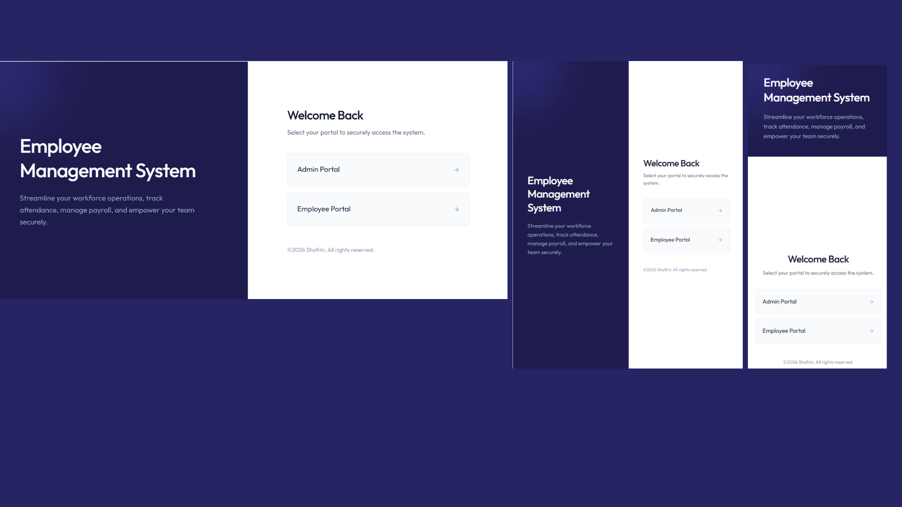

# 🚀 Employee Management System (EMS)

<p align="center">


<p align="center">
A modern Full Stack Employee Management System built using React, Node.js, Express.js, MongoDB, and JWT Authentication.
</p>

---

# 🌐 Live Demo

### 🔗 Frontend
https://ems-lime-seven.vercel.app/login

### 🔗 Backend API
https://ems-z425.onrender.com

---

# 📖 About the Project

Employee Management System (EMS) is a secure and responsive web application that simplifies employee management for organizations.

The system provides separate dashboards for Administrators and Employees, allowing efficient management of employees, attendance, leave requests, payroll, and profiles through a modern and user-friendly interface.

This project follows industry-standard full-stack development practices using React, Express.js, MongoDB, REST APIs, and JWT Authentication.

---

# ✨ Features

## 🔐 Authentication

- Secure Login & Logout
- JWT Authentication
- Role-Based Authorization
- Protected Routes
- Password Encryption using bcrypt

---

## 👨‍💼 Admin Features

- Dashboard Overview
- Employee Management (CRUD)
- Department Management
- Attendance Management
- Leave Approval & Rejection
- Payroll Management
- Employee Profile Management
- Responsive Admin Dashboard

---

## 👨‍💻 Employee Features

- Secure Login
- Dashboard Overview
- View & Update Profile
- Attendance Tracking
- Apply Leave
- View Leave Status
- View Payslips
- Change Password

---

# 📊 Dashboard

The Admin Dashboard displays:

- 👨 Total Employees
- 🏢 Departments
- 📅 Today's Attendance
- 📝 Pending Leave Requests

---

# 🛠 Tech Stack

## Frontend

- React.js
- React Router DOM
- Axios
- Bootstrap
- CSS3

## Backend

- Node.js
- Express.js

## Database

- MongoDB Atlas
- Mongoose

## Authentication

- JWT (JSON Web Token)
- bcrypt

## Deployment

- Vercel
- Render

---

# 📂 Project Structure

```text
EMS
│
├── Client
│   ├── src
│   ├── public
│   └── package.json
│
├── server
│   ├── controller
│   ├── middleware
│   ├── models
│   ├── routes
│   ├── server.js
│   └── package.json
│
├── README.md
└── .gitignore
```

---

# ⚙️ Installation

## Clone the Repository

```bash
git clone https://github.com/ShafrinSulthan/EMS.git
```

## Frontend Setup

```bash
cd Client
npm install
npm run dev
```

## Backend Setup

```bash
cd server
npm install
npm start
```

---

# 🔑 Environment Variables

Create a `.env` file inside the **server** folder.

```env
PORT=4000

MONGODB_URI=YOUR_MONGODB_CONNECTION_STRING

JWT_SECRET=YOUR_SECRET_KEY
```

---

# 🔗 REST API Endpoints

## Authentication

- POST `/api/auth/login`
- POST `/api/auth/register`

## Employees

- GET `/api/employees`
- POST `/api/employees`
- PUT `/api/employees/:id`
- DELETE `/api/employees/:id`

## Attendance

- GET `/api/attendance`
- POST `/api/attendance`

## Leave

- GET `/api/leave`
- POST `/api/leave`

## Payslip

- GET `/api/payslip`

---

# 🚀 Deployment

### Frontend
- Vercel

### Backend
- Render

### Database
- MongoDB Atlas

---

# 💡 Future Enhancements

- Email Notifications
- Dark Mode
- Employee Analytics Dashboard
- Salary Reports
- PDF Report Generation
- Mobile Application
- Calendar Integration
- Real-Time Notifications

---

# 🎯 Learning Outcomes

Through this project, I gained practical experience in:

- Building Full Stack Applications
- React Component Architecture
- Express REST API Development
- MongoDB CRUD Operations
- JWT Authentication
- Role-Based Access Control
- Axios API Integration
- Responsive UI Design
- Deployment using Vercel & Render
- Secure Backend Development

---

# 📸 Screenshots

## Responsive UI



---

Watch the complete project demo below:
[EMS.mp4](https://drive.google.com/file/d/1_8IesvJk9qrzVCI0G09hUYKn21od3WZ8/view?usp=sharing)

---

# 👩‍💻 Author

## Shafrin M

**B.Tech – Computer Science Engineering (Artificial Intelligence & Data Science)**

### GitHub

https://github.com/ShafrinSulthan

### LinkedIn

Add your LinkedIn profile URL here.

---

# ⭐ Support

If you found this project useful,

⭐ **Please consider giving this repository a Star!**

It motivates me to continue building high-quality projects.

---

# 📄 License

This project was developed for educational, learning, and portfolio purposes.
